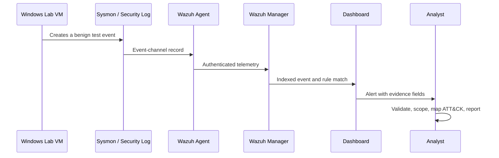

# Lab Architecture and Data Flow

## Components

| Component | Role | Security boundary |
| --- | --- | --- |
| Windows 11 lab VM | Produces authentication and process telemetry | Isolated test endpoint; no production identity or data |
| Sysmon | Enriches process creation with command line, hashes, and parent process | Endpoint telemetry source |
| Windows Event Log | Records authentication and account-management events | Endpoint telemetry source |
| Wazuh agent | Reads designated Windows event channels and forwards telemetry | Authenticated endpoint-to-manager connection |
| Wazuh manager/indexer/dashboard | Parses, stores, searches, and presents events | SOC monitoring zone |
| Analyst workstation | Reviews alerts and writes reports | Read-only access to evidence whenever possible |

## Data flow

## Design decisions

- **Separate endpoint and monitoring roles.** The test endpoint should not also be the SIEM host; this makes the telemetry path realistic and protects the manager from endpoint experimentation.
- **Sysmon complements, not replaces, Security logging.** Security Event ID 4625 captures failed logons; Sysmon Event ID 1 supplies process and parent-process context.
- **Portable rules first.** Sigma rules in this repository preserve detection intent independently of the SIEM. A platform-specific Wazuh implementation comes only after the baseline is understood.
- **Evidence over screenshots.** Screenshots are supporting material. Reports should state event IDs, timestamps, host, user, source, and the query or rule that produced the conclusion.

## Scope and safety constraints

The lab is limited to assets owned or explicitly authorized by the project owner. Simulations must remain benign: use test accounts, non-routable lab addressing, and commands such as `Write-Output` or `cmd /c echo`. Do not test credentials, payloads, persistence, evasion, or lateral movement against real systems.
